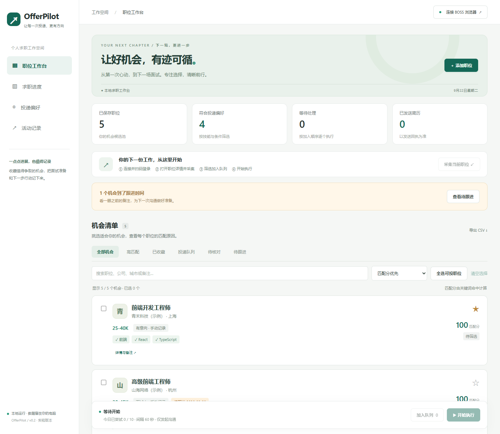
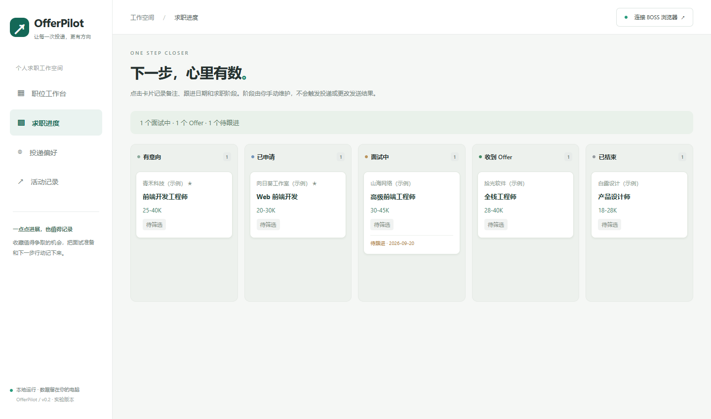

# OfferPilot · 精准投递工作台

**先筛选合适的机会，再有序投递。**

OfferPilot 是一个本地运行的 BOSS 直聘求职助手。它将职位收藏、关键词匹配、投递队列和结果追踪放在同一个中文工作台中，并通过可见浏览器执行沟通及附件简历发送流程。

适合想减少重复操作、保留投递记录，并愿意逐项核对职位的求职者，也适合研究浏览器自动化的开发者。

**版本：0.2.0 · 实验性 MVP · MIT 开源许可证**

[安装运行](#安装运行) · [使用教程](#第一次使用) · [常见问题](#常见问题) · [反馈问题](https://github.com/yunqilu880-cyber/offerpilot-boss/issues) · [页面适配说明](docs/boss-adapter.md)





截图中的公司与职位为虚构演示数据，实际启动不会自动添加这些记录。

> **当前可用性说明**
>
> 工作台、匹配规则、队列、本地存储和模拟页面投递流程已经完成实现并进行测试。**尚未使用真实 BOSS 账号验证登录后的页面和附件发送流程。** 默认页面选择器仍需真实页面核验，不能保证下载后直接自动投递。
>
> 建议先体验本地职位管理，再以单个确实想申请的职位进行联调。模拟页面测试通过，不等于已验证真实平台兼容性。

## 目录

- [项目定位](#项目定位)
- [功能一览](#功能一览)
- [安装运行](#安装运行)
- [第一次使用](#第一次使用)
- [匹配规则与配置](#匹配规则与配置)
- [投递状态与队列机制](#投递状态与队列机制)
- [本地数据与隐私](#本地数据与隐私)
- [高级配置](#高级配置)
- [常见问题](#常见问题)
- [开发与测试](#开发与测试)
- [项目结构](#项目结构)
- [参与贡献](#参与贡献)
- [后续方向](#后续方向)
- [项目来源与许可证](#项目来源与许可证)

## 项目定位

OfferPilot 的核心流程是：

```text
手动添加 / 浏览器采集职位
          ↓
关键词评分 + 城市 / 薪资 / 公司筛选
          ↓
用户选择职位并加入队列
          ↓
确认执行模式，浏览器逐个处理
          ↓
记录沟通 / 简历发送结果，异常时暂停核对
```

当前发布方式是 **GitHub 源码仓库 + 本地运行程序**。网页工作台背后依赖 Node.js 服务、SQLite 和本机浏览器，不能只把 `public/` 上传到静态托管平台就获得完整投递功能。

当前还没有 Windows 一键安装包、在线多用户服务、微信小程序或 iOS App。

## 0.2 新增：职位管理与求职跟进

- **收藏与筛选**：星标收藏职位，按收藏、到期跟进或投递状态快速筛选；搜索支持职位、公司、城市和个人备注。
- **排序与批量操作**：按最近添加、匹配分或跟进日期排序；全选当前筛选结果中符合投递条件的职位，最多选择 100 个。切换筛选会保留已选项，点击「清空选择」统一取消。
- **详情与备注**：点击职位名称或「详情与备注」查看完整描述、原始链接和匹配情况，记录面试准备或下一步行动。
- **跟进日期**：设置下次跟进日期，按北京时间判断今天及已过期项目；仅在工作台内提示，不发送系统通知。已结束阶段不显示到期提醒。
- **求职进度看板**：通过职位详情手动设置有意向、已申请、面试中、收到 Offer、已结束。看板阶段不自动推断发送结果，也不会触发或停止自动投递；结束阶段仍需自行移出尚未执行的队列。
- **持久化与导出**：收藏、备注、阶段、跟进日期保存到 SQLite，重启后保留，CSV 同步导出这些字段。原数据库会自动新增跟进表，无需清空历史。

这一轮参考了 [Huntr 的求职看板](https://huntr.co/product/job-tracker) 与 [Teal 的职位备注工作流](https://help.tealhq.com/en/articles/9525013-leveraging-your-job-tracker-tools) 的公开功能说明，界面和代码均独立实现，未复用其素材。

## 功能一览

| 功能 | 当前行为 |
| --- | --- |
| 中文工作台 | 职位清单、统计卡片、搜索、状态筛选、投递偏好、活动记录 |
| 手动添加职位 | 填入 BOSS 职位链接、职位名称、公司、城市、薪资和描述 |
| 浏览器采集 | 从受控浏览器的独立职位详情标签页读取信息；页面适配待实站验证 |
| 可解释的匹配 | 显示关键词命中情况、匹配分，以及城市、薪资、公司排除原因 |
| 投递队列 | 手动选中合适职位后入队，按加入顺序串行处理 |
| 沟通模式 | 尝试发起沟通，并在页面确认后记录为「已发起沟通」 |
| 附件简历模式 | 核对会话与指定文件名，尝试发送 BOSS 已上传的附件简历并检查回执 |
| 简历版本选择 | 可在不同批次切换附件完整名称；同一轮使用同一份配置 |
| 去重与限额 | 按规范化职位链接去重，记录每日尝试次数，控制执行间隔 |
| 异常处理 | 遇到验证、页面变化或未知结果时暂停，保留待核对记录 |
| 本地持久化 | SQLite 保存职位、偏好和活动，独立浏览器目录保存登录会话 |
| CSV 导出 | 导出职位、公司、城市、薪资、匹配分、状态、备注和链接 |

目前不包含搜索结果自动翻页采集、AI 简历生成、语义匹配、自动复聊、跨平台投递、验证码代解或风控绕过。

## 安装运行

### 1. 准备环境

| 项目 | 要求 |
| --- | --- |
| Node.js | **24 或更高版本**，项目使用内置 `node:sqlite` |
| npm | 随 Node.js 安装，用于安装依赖和执行命令 |
| Git | 使用 `git clone` 时需要；也可以下载 ZIP |
| 浏览器 | Playwright Chromium，或本机已安装的 Chrome / Microsoft Edge |
| 运行环境 | 有图形桌面的电脑；投递时需要保持服务和受控浏览器运行 |

当前本地验证环境为 Windows。代码未限定只能在 Windows 运行，但 macOS / Linux 的真实平台投递兼容性尚未验证；Linux 可能需要额外的浏览器系统依赖。

在终端检查环境：

```bash
node --version
npm --version
git --version
```

### 2. 获取项目

```bash
git clone https://github.com/yunqilu880-cyber/offerpilot-boss.git
cd offerpilot-boss
```

不熟悉 Git 的用户可以在仓库页面点击 **Code → Download ZIP**，解压后在包含 `package.json` 的文件夹打开终端，再执行下面的命令。

### 3. 安装依赖与浏览器

```bash
npm ci
npm run browser:install
```

`npm ci` 根据锁文件安装依赖；浏览器安装命令会下载 Chromium，首次运行需要联网。

如果希望使用已安装的 Chrome / Edge，可以省略 `browser:install`，启动工作台后在「投递偏好」中选择对应浏览器并保存。

Linux 上若缺少系统依赖，可使用：

```bash
npx playwright install --with-deps chromium
```

### 4. 启动工作台

```bash
npm start
```

终端出现以下信息后，打开 [http://127.0.0.1:3210](http://127.0.0.1:3210)：

```text
OfferPilot 已启动：http://127.0.0.1:3210
```

运行期间保留终端窗口。下次使用只需进入项目目录执行 `npm start`，不必重复安装依赖。

结束使用时，先在工作台停止执行，等待当前操作退出，再在终端按 `Ctrl+C`。程序会尝试关闭受控浏览器并结束服务。

### 5. 更新代码

停止程序并备份本地数据后，在项目目录执行：

```bash
git pull --ff-only
npm ci
npm run browser:install
npm start
```

如果修改过源码或选择器，请先保存自己的修改，再处理 Git 提示；不要直接覆盖本地改动。更新 Playwright 后可能需要重新下载对应浏览器。

## 第一次使用

### 第一步：配置投递偏好

打开「投递偏好」，填写职位关键词、城市、最低月薪和公司排除词。首次建议设置较小的每日额度，使用默认的「仅发起沟通」模式。

例如，你希望寻找上海的前端岗位，可以设置：

| 选项 | 示例值 |
| --- | --- |
| 目标技能 / 职位关键词 | `前端, React, TypeScript` |
| 期望城市 | `上海` |
| 最低月薪 | `20`，单位为 K，即月薪 20,000 元 |
| 最低匹配分 | `60` |
| 每天最多尝试 | `1`，先验证单个职位 |
| 投递间隔 | `60` 秒 |
| 执行模式 | 仅发起沟通 |

点击「保存偏好」。队列运行时不能修改偏好，需要先停止执行。

### 第二步：连接浏览器并登录

点击右上角「连接 BOSS 浏览器」，在新打开的浏览器中手动扫码登录 BOSS 直聘。

这里使用项目自己的浏览器配置目录。日常浏览器中的登录状态不会自动导入。「浏览器已打开」仅表示连接存在，不代表已经成功登录。

### 第三步：添加职位

支持两种方式：

- **手动添加**：点击「添加职位」，粘贴详情链接并填写职位信息。无需先登录即可体验本地匹配与管理。
- **浏览器采集**：在程序打开的浏览器里，将目标职位打开为独立详情标签页，再点击「采集当前职位」。多个职位详情标签页存在时，采集最后打开的那个，不保证是当前获得焦点的标签页。

详情链接应是 `https://www.zhipin.com/job_detail/职位标识.html` 形式。搜索页、聊天页或其他网站的链接不能作为职位详情导入。

采集或手动添加后，请核对职位名称、公司和描述。相同规范化链接会返回已有记录，不会新增，也不会覆盖旧职位信息。

### 第四步：查看匹配结果并加入队列

工作台会显示每个职位的匹配分、命中的关键词，以及未满足的条件。

只有符合当前偏好、且尚未尝试过的职位才能被选中加入队列。已在队列中的职位可以在执行停止时点击「移出队列」。

### 第五步：确认并执行

点击「开始执行」，检查弹窗中的职位数量、执行模式和剩余每日额度，再确认开始。

执行时，程序会重新打开职位详情，核对职位名称与公司，并根据实时读取的内容再次检查匹配条件。页面信息变化或无法识别时会暂停，而不是继续盲目点击。

### 第六步：需要附件投递时再切换模式

附件简历模式需要：

1. 先自行在 BOSS 上传附件简历。
2. 在投递偏好中选择「发起沟通并发送指定附件简历」。
3. 填写附件的**完整显示名称**，例如 `张三-前端开发.pdf`。
4. 保存配置，再选取一个新的、未尝试过的职位验证流程。

程序需要唯一识别当前会话的公司与职位、对应的附件以及新增发送回执，才会自动记录为「已发送简历」。项目不会从电脑中自动选择文件上传，也不会修改简历内容。

**已发起沟通不等于已发送简历。** 已经有沟通记录的职位会进入人工核对流程，当前版本不会自动在旧会话中补发附件。

### 第七步：核对异常与查看记录

遇到「待人工核对」时，先去 BOSS 检查实际结果，再在工作台标记为已沟通、已发简历，或者未发送 / 跳过。人工标记会留下单独的活动记录。

「活动记录」显示最近 100 条事件；「导出 CSV」可以保存职位及当前状态。CSV 中的状态使用内部英文标识，对照表见下文。

## 匹配规则与配置

### 关键词评分

```text
匹配分 = 四舍五入（命中关键词数量 ÷ 配置关键词总数 × 100）
```

匹配范围是**职位名称 + 职位描述**，采用不区分英文大小写的子串匹配，不是 AI 语义分析。一个关键词出现多次仍只算命中一次。

例如配置 `前端, React, TypeScript`，职位名称及描述命中 `前端` 和 `React`，得分约为 **67 分**。如果关键词列表为空，匹配分为 **100 分**，其他硬条件仍然生效。

### 硬性筛选条件

- **公司排除**：公司名称包含任一排除词就不通过，英文不区分大小写。
- **期望城市**：职位城市字段包含任一配置城市才通过；列表为空表示不限城市。启用限制但城市未读取到时，不会自动视为通过。
- **最低月薪**：比较月薪区间的下限。例如 `20-35K·14薪` 按 `20K` 比较，不计算年薪。
- **最低匹配分**：得分必须达到所设门槛。

薪资解析支持如 `20-35K`、`20-35K·14薪` 的格式。启用最低月薪时，`面议`、日薪、时薪或其他无法识别的格式不会被推测为符合条件。

### 默认值与范围

| 配置 | 默认值 | 可设置范围 / 行为 |
| --- | --- | --- |
| 关键词 | 前端、React、TypeScript | 逗号分隔；也支持中文逗号 |
| 期望城市 | 不限 | 可填写多个城市 |
| 排除公司 | 无 | 按公司名称包含关键词排除 |
| 最低月薪 | 0 K | 0–1000 的整数；0 表示不限制 |
| 最低匹配分 | 40 | 0–100 的整数 |
| 每天最多尝试 | 10 | 1–100 的整数 |
| 投递间隔 | 60 秒 | 30–3600 的整数 |
| 浏览器 | Chromium | Chromium / Chrome / Microsoft Edge |
| 执行模式 | 仅发起沟通 | 可切换为附件简历模式 |
| 附件名称 | 空 | 附件模式必填，与 BOSS 显示名称一致 |

## 投递状态与队列机制

| 状态标识 | 界面显示 | 含义 |
| --- | --- | --- |
| `saved` | 待筛选 | 已保存，还没有加入执行队列 |
| `queued` | 等待投递 | 已入队，等待串行处理 |
| `running` | 处理中 | 已开始处理该职位 |
| `contacted` | 已发起沟通 | 页面确认了沟通，或用户人工核对后标记 |
| `resume_sent` | 已发送简历 | 检测到新的附件发送回执，或用户人工核对后标记 |
| `needs_review` | 待人工核对 | 无法确认结果、页面异常、已有沟通或上次处理被中断 |
| `skipped` | 已跳过 | 执行前不符合偏好，或经人工核对后选择跳过 |

队列遵循以下规则：

- **链接去重**：去掉详情 URL 的查询参数和锚点后去重；同一职位的不同跟踪链接只保存一次。它不是跨链接的公司 / 岗位语义去重。
- **逐个执行**：按加入队列的先后处理，不并发联系多个招聘者；单次入队支持 1–100 个职位。
- **次数口径**：按北京时间统计每天的处理尝试；一旦开始处理就计入，后续失败也计入。程序额度不等于平台允许的额度。
- **停止行为**：可中断间隔等待，并在后续发送步骤前检查停止状态；已发生的操作不能撤回，正在进行的页面等待可能需要时间退出。
- **异常暂停**：未知结果时暂停整轮，后续职位保留在队列中。处理问题后需要用户主动再次开始，不会自行重启。
- **中断恢复**：重启后，原先处于处理中的职位转为待核对；其余队列记录保留，但不会自动开始运行。
- **已尝试不重投**：存在尝试记录的职位不能重新自动入队，即使后来标记为跳过。未实际尝试、仅因条件不符而跳过的职位，可以在满足偏好后重新选择。

## 本地数据与隐私

默认运行数据位于项目根目录的 `data/`，首次启动自动创建：

```text
data/
├── offerpilot.sqlite        # 职位、配置和活动记录
├── offerpilot.sqlite-wal    # 运行期间可能出现的 SQLite 辅助文件
├── offerpilot.sqlite-shm    # 运行期间可能出现的 SQLite 辅助文件
├── browser/                # 独立浏览器的会话、Cookie 等数据
└── screenshots/            # 部分执行异常时保存的页面截图
```

`data/`、依赖目录和测试产物已加入 `.gitignore`。**不要将登录会话、真实简历或未脱敏聊天截图提交到公开仓库。** 这些本地文件没有额外的应用层加密，请妥善管理电脑访问权限。

执行投递时，受控浏览器会正常连接 BOSS 直聘；「本地保存」不表示投递过程不发生网络通信。

备份时，先停止程序并关闭受控浏览器，再复制整个数据目录到私人位置。CSV 导出只是职位报表，不是完整备份。删除数据库会丢失去重历史，不应把清空数据作为异常重试手段。

本地服务绑定 `127.0.0.1`，并检查 Host、Origin 和写请求头。当前没有多用户登录与权限系统，不支持把同一个服务公开给多人使用，也不支持多个进程共享同一数据目录。

## 高级配置

### 环境变量

| 变量 | 默认 | 作用 |
| --- | --- | --- |
| `PORT` | `3210` | 本地工作台端口 |
| `OFFERPILOT_DATA_DIR` | 项目目录下的 `data/` | 数据库、浏览器会话和截图保存目录 |
| `BOSS_SELECTORS` | 内置 `config/boss-selectors.json` | 自定义选择器 JSON 文件路径 |

相对环境变量路径按启动时的工作目录解析，建议从项目根目录启动；数据目录也可以使用绝对路径。程序目前不会自动加载 `.env` 文件，请在终端设置环境变量。

Windows PowerShell 示例：

```powershell
$env:PORT = '3211'
$env:OFFERPILOT_DATA_DIR = 'D:\OfferPilotData'
npm start
```

macOS / Linux 终端示例：

```bash
PORT=3211 OFFERPILOT_DATA_DIR="$HOME/OfferPilotData" npm start
```

更换端口后，请访问对应地址，例如 `http://127.0.0.1:3211`。自定义到项目目录内的新数据路径时，还需要自行将该路径加入 `.gitignore`。

### 页面选择器适配

BOSS 页面结构可能变化。默认选择器集中在 [config/boss-selectors.json](config/boss-selectors.json)，真实页面适配步骤见 [BOSS 适配器维护说明](docs/boss-adapter.md)。

建议复制完整配置到 `data/boss-selectors.local.json`，根据已观察到的真实 DOM 修改，再设置：

```powershell
$env:BOSS_SELECTORS = 'data/boss-selectors.local.json'
npm start
```

自定义文件会替换整份选择器配置，而不是与默认值逐项合并。不要通过放宽公司、职位或回执判断来强行继续投递。新标签页聊天、iframe 或额外确认弹窗可能需要修改适配器代码。

## 常见问题

| 问题 / 提示 | 检查方式 |
| --- | --- |
| 找不到 `npm` / `node` | 安装 Node.js 24+ 后重新打开终端，检查版本命令是否可用 |
| PowerShell 提示禁止运行 `npm.ps1` | 可使用 `npm.cmd ci`、`npm.cmd start` 等命令，或改用命令提示符 |
| 不支持 `node:sqlite` | 确认当前终端实际使用的是 Node.js 24+，排查旧版 Node 路径 |
| 浏览器可执行文件不存在 | 执行 `npm run browser:install`，或选择电脑已有的 Chrome / Edge |
| 地址打不开 | 确认终端服务仍在运行，端口与访问地址一致，并使用 `127.0.0.1` |
| `EADDRINUSE` | 检查是否已经启动一份程序；关闭旧实例后重试，或使用其他空闲端口。不要同时共享一个数据目录 |
| 日常浏览器已登录，程序仍要求登录 | 登录状态隔离是当前设计，需要在程序打开的窗口登录 |
| 无法采集职位 | 确认是在受控浏览器中打开独立职位详情页；详情侧栏、搜索页不支持。也可能需要适配页面选择器 |
| 选择器无法唯一识别元素 | 页面存在多个匹配或结构变化，查看适配文档；不要自动选择第一个不明元素 |
| 无法勾选职位 | 查看匹配原因、当前状态和是否已有尝试记录 |
| 开始按钮不可用 | 检查浏览器是否已打开、是否存在等待投递的职位 |
| 达到每日尝试上限 | 当天失败也会计数；次日额度重新按日期计算，仍需手动开始 |
| 显示已沟通，但没有附件 | 检查是否选择了仅沟通模式；已有沟通的职位不会自动补发附件 |
| 附件找不到或没有回执 | 检查 BOSS 上传的文件名是否完整匹配、会话信息是否准确，以及选择器是否适配 |
| 出现验证码或平台限制 | 程序会暂停，请在浏览器手动处理并核对结果；不会自动绕过 |
| 能否只发布网页文件 | 当前完整程序还需要 Node.js 服务、数据库与浏览器执行器，不能仅靠静态网页运行 |
| 是否需要 AI API Key | 当前版本不需要；评分由本地关键词规则实现 |
| 是否支持其他招聘平台 | 当前只实现 BOSS 适配器框架，没有其他平台的投递实现 |

## 开发与测试

### 技术组成

- **运行时**：Node.js 24+、ES Modules。
- **本地服务**：Express 5，提供静态界面和 HTTP API。
- **浏览器执行**：Playwright，通过独立的持久化浏览器上下文工作。
- **存储**：Node.js 内置 SQLite，保存职位、偏好和事件。
- **界面**：原生 HTML / CSS / JavaScript，无需额外前端构建步骤。
- **测试**：Node.js 内置测试运行器，浏览器场景使用 Playwright 合成页面。

### 常用命令

| 命令 | 用途 |
| --- | --- |
| `npm ci` | 按锁文件安装依赖 |
| `npm start` | 正常启动本地服务 |
| `npm run dev` | 以 Node watch 模式开发；不要用于真实投递，文件变化会重启进程 |
| `npm run browser:install` | 安装 Playwright Chromium |
| `npm test` | 运行核心逻辑与本地 API 测试 |
| `npm run test:browser` | 运行模拟页面的浏览器适配器测试 |

测试不使用真实 BOSS 账号，也不会向真实招聘者发送消息。浏览器测试通过请求拦截返回合成页面，默认以无头 Chromium 运行。

当前在本地通过了 **11 项核心 / API 测试和 5 个浏览器场景**：

- 评分、城市和薪资排除、URL 校验、配置范围。
- 链接去重、队列顺序、每日额度、未知结果暂停、停止等待与重启恢复。
- 本机 API 访问保护与 CSV 导出中的公式前缀处理。
- 跟进信息持久化、旧数据库兼容、日期校验和手动阶段与投递状态隔离。
- 仅发起沟通、附件发送回执、会话错配、验证码拦截、已有沟通。

这项验证不覆盖真实 BOSS 当前页面，也不代表已经通过所有操作系统验证。

### GitHub Actions

[docs/ci.example.yml](docs/ci.example.yml) 提供 Windows / Linux 测试矩阵模板。当前仓库**尚未启用自动 CI**：首次发布所用凭证缺少上传工作流的 `workflow` 权限，因此将配置作为模板保留。

维护者可通过 GitHub 网页创建 `.github/workflows/ci.yml` 并复制模板内容，在仓库允许 Actions 的情况下启用自动测试。浏览器测试同样使用合成页面，不需要配置招聘账号密钥。

## 项目结构

```text
offerpilot-boss/
├── config/
│   └── boss-selectors.json   # BOSS 页面定位配置
├── docs/
│   ├── boss-adapter.md      # 页面适配与联调说明
│   ├── ci.example.yml       # 尚未启用的 GitHub Actions 模板
│   └── workspace.png        # 工作台截图
├── public/
│   ├── index.html           # 中文界面结构
│   ├── styles.css           # 基础界面样式
│   ├── workspace.css        # 工作台、详情与看板的响应式样式
│   ├── app.js               # 界面交互与 API 请求
│   └── favicon.svg          # 项目图标
├── src/
│   ├── domain.js            # 匹配、输入校验、日期口径
│   ├── store.js             # SQLite 存储与去重
│   ├── runner.js            # 串行队列、停止与次数限制
│   ├── boss.js              # 浏览器采集和投递适配器
│   └── server.js            # 本地 HTTP 服务
├── test/
│   ├── core.test.js         # 核心业务测试
│   ├── server.test.js       # HTTP API 测试
│   ├── tracking.test.js     # 跟进持久化与接口验证
│   └── browser/
│       └── adapter.test.js  # 模拟页面投递测试
├── .gitignore
├── LICENSE
├── package.json
├── package-lock.json
└── README.md
```

运行后生成的 `data/` 不属于公开仓库内容。

## 参与贡献

欢迎提交 Bug、页面适配修复、使用体验反馈和文档改进。

提交 [Issue](https://github.com/yunqilu880-cyber/offerpilot-boss/issues) 时，请尽量提供系统、Node.js 与浏览器版本、复现步骤、预期结果、实际结果及脱敏错误文字。不要上传 Cookie、完整聊天记录或真实简历。

提交代码前运行相关测试；如果修改投递流程，请补充对应的模拟页面场景，特别是会话匹配、发送确认与异常暂停。尚未完成真实平台验证的改动，请明确标注。

## 后续方向

以下内容仅为候选方向，**不是当前已支持的功能或交付承诺**：

- 完成真实 BOSS 页面联调，维护明确的适配版本。
- 提供 Windows 一键安装包，简化首次启动。
- 完善职位编辑、归档和筛选体验。
- 增加更完整的简历版本管理和面试日程能力。
- 根据实际用户需求评估浏览器插件和手机查看进度的入口。

## 项目来源与许可证

本项目仅参考 [GeekGeekRun](https://github.com/geekgeekrun/geekgeekrun) README 对求职自动化场景的介绍。未复用其源码、组件或素材，不是其 fork；架构、界面、匹配与队列逻辑独立编写。

OfferPilot 不是 BOSS 直聘官方产品，也不代表与该平台存在合作关系。使用时请了解平台规则，核对职位与接收方，并根据实际情况控制执行频率。

项目采用 [MIT License](LICENSE)，允许依照许可证使用、修改与分发；软件按现状提供。
